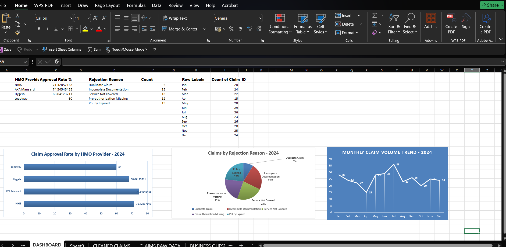

# Project 1 : Health Insurance Claims Analysis (Nigerian HMO Dataset)

  

---

## Problem Statement

A Nigerian hospital submits hundreds of insurance claims monthly to multiple HMO providers. The finance team needed to understand why a significant proportion of claims were not being fully reimbursed, which HMO partners were performing poorly, and what financial exposure the hospital faced from unresolved claims.

---

## Dataset

| Detail | Description |
|---|---|
| Records | 300 insurance claims (after duplicate removal) |
| Period | January – December 2024 |
| Source | Simulated Nigerian HMO claims dataset |
| HMO Partners | NHIS, AXA Mansard, Hygeia, Leadway |
| Hospital Branches | Ikeja, Lekki, Yaba, Surulere, Apapa |
| Files | `raw_claims.xlsx` / `cleaned_claims.xlsx` |

---

## Tools Used

- **Microsoft Excel 365** : data cleaning, formula analysis, pivot tables, conditional formatting, charts

---

## Data Cleaning Process

| Step | Action |
|---|---|
| 1 | Identified and removed 3 duplicate claims using Claim_ID as unique identifier |
| 2 | Standardised Claim Status from 6 inconsistent versions to 4 clean categories: Approved, Rejected, Pending, Partially Approved |
| 3 | Calculated Turnaround Days (Approval Date - Claim Date) using IF logic to handle Pending claims with no approval date |
| 4 | Flagged 20 missing Claim Amount values instead of deleting affected rows |
| 5 | Validated that blank Approval Dates were logically correct (Pending claims only) |

---

## Analysis & Key Findings

### Finding 1 : Overall Approval Rate: 69%
The hospital's overall claim approval rate (Approved + Partially Approved) is **69%**, meaning **31% of submitted claims are rejected, pending, or only partially reimbursed**, representing a major financial exposure for the hospital.

### Finding 2 : Leadway Has the Highest Rejection Rate: 24%
Among all four HMO partners, Leadway recorded the highest rejection rate at **24%**, nearly 1 in 4 claims rejected. This is significantly above NHIS (17.3%), Hygeia (17.5%), and AXA Mansard (18.2%).

| HMO | Rejection Rate | Approval % by Value | Avg Turnaround |
|---|---|---|---|
| NHIS | 17.3% | 66.9% | 11.3 days |
| AXA Mansard | 18.2% | 73.5% | 9.4 days |
| Hygeia | 17.5% | 64.4% | 11.7 days |
| **Leadway** | **24.0%** | **64.4%** | **9.5 days** |

### Finding 3 : "Service Not Covered" is Leadway's Dominant Rejection Reason
50% of Leadway's rejected claims cite "Service Not Covered", combined with its fast turnaround time (9.5 days), this pattern suggests an automated or rules-based rejection system rather than thorough case-by-case review.

### Finding 4 : ₦15.7 Million in Pending Claim Exposure
37 claims (12.3% of total) remain Pending, with a combined claim value of **₦15,720,467**, money the hospital has spent on patient care without confirmation of reimbursement.

### Finding 5 : Ikeja Branch Generates Highest Claim Value
Ikeja Branch submitted the highest total claim value at **₦28.8 million**, compared to Yaba Branch at the lowest with ₦21.4 million. Missing claim amounts are evenly distributed across branches (4–5 per branch), confirming this ranking is not distorted by data gaps.

### Finding 6 : July is Peak Claims Month
Claim volume peaks in **July (36 claims)** and drops sharply in **April (15 claims)**, reflecting seasonal healthcare demand patterns consistent with Nigerian climate and economic cycles.

---

## Dashboard Preview

Charts built:
- Bar Chart - Claim Approval Rate by HMO Provider
- Pie Chart - Claims by Rejection Reason
- Line Chart - Monthly Claim Volume Trend 2024
- Conditional Formatting - Turnaround Days >20 highlighted in red (slow claims)

---

##  Recommendations

1. **Urgent Leadway review** : Conduct a formal claims audit with Leadway to challenge their rejection patterns, particularly "Service Not Covered" cases. Request clarification on their coverage list and align hospital billing teams accordingly.

2. **Pre-authorisation protocol** : Implement mandatory pre-authorisation checks for Leadway-insured patients before rendering services, to reduce post-treatment rejections.

3. **Pending claims follow-up** : Establish a dedicated weekly follow-up process for all claims Pending beyond 14 days. The ₦15.7 million exposure requires active management, not passive waiting.

4. **Seasonal staffing for claims** : Given the July volume spike, increase claims processing staff during June–August to prevent turnaround delays during peak periods.

---

##  Data Story

*"This project analysed a 300-claim Nigerian HMO dataset containing inconsistent status values, duplicate records, and missing claim amounts. After cleaning and standardising the data, the overall claim approval rate was found to be 69%, meaning 31% of claims submitted by the hospital remain unresolved, rejected, or only partially reimbursed, representing a significant financial risk. Leadway HMO recorded the highest rejection rate at 24%, with 'Service Not Covered' as the dominant rejection reason, suggesting a narrow coverage policy or an automated review system that blocks claims without thorough case-by-case assessment. Additionally, 37 claims (12.3%) remain Pending, exposing ₦15.7 million in unresolved reimbursements. Claim volume peaks in July and drops sharply in April, reflecting seasonal healthcare demand patterns consistent with Nigerian climate and economic cycles. We recommend the hospital conduct an urgent review of its Leadway partnership, implement pre-authorisation checks before rendering services to Leadway-insured patients, and establish a dedicated claims follow-up process for Pending claims older than 14 days."*

---

## About

**Ogoma Maris Okuma** | Biochemistry Graduate → Healthcare Data Analyst  
Building a portfolio in healthcare analytics using Excel, SQL, and Power BI.  
Gmail [marisokuma39@gmail.com]| Linkedin [www.linkedin.com/in/ogoma-okuma-a09ba4344]

---

*This project is part of an ongoing Healthcare Analytics Portfolio. Dataset is simulated for learning purposes.*
